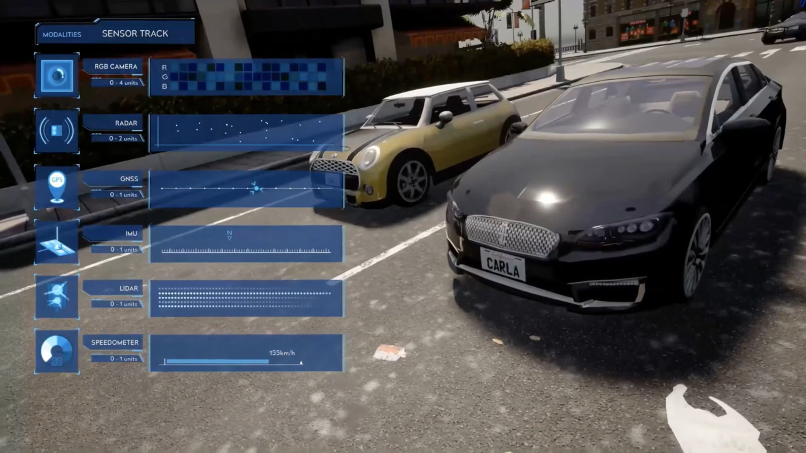
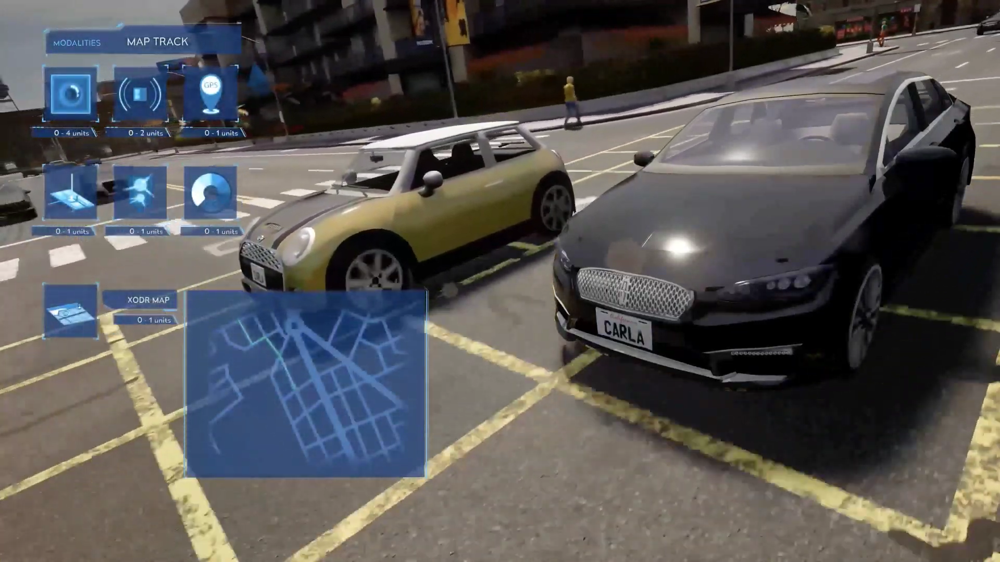

# Carla 

Autonomous Driving Simulator 🚗

[](https://www.youtube.com/watch?v=7jej46ALVRE)


## Setup Carla

- Read [CARLA Setup Guide (Windows x64).pdf](https://d3c33hcgiwev3.cloudfront.net/IFfxQie8Eem9HA6xGGaRfg_20f6060027bc11e98ed3dfcfdba7c72b_CARLA-Setup-Guide-_Windows-x64_.pdf?Expires=1634342400&Signature=O7-bO5nGH1Ud2k2SMjX~YzuVO0dHQdeIjswRtRqLAHx9G~uYOSPzQVF4E6q6G7oBk232kNPKKuVT76SfURnvc-1Bd-dQdMfMF158LZdWHWFlo9L8PJ~nDSLNWF~hLtUD2WN-PnUFJcO4kKnYb4FKX4sxyme1y8VrRN1BkRGQkKs_&Key-Pair-Id=APKAJLTNE6QMUY6HBC5A)

- Install 
[CarlaUE4Windows](https://d3c33hcgiwev3.cloudfront.net/uuTN7y7rEemnrA4AsaAhFA_bbb340f02eeb11e9a59e73356fd63643_CarlaUE4Windows.zip?Expires=1634342400&Signature=N~xsY2z4th4BiAskN6GUdxxTF~m5CK-mFXpWkOxPm1naqq5O5DZ01KPohMdcp4rGEfTxO~hqHnWe9rXmKLz9PxGTinaRLmg4-tyPf9RWvLThDLp-Dm1aUOLcJx46w4YMgqg4u~NbIBpxbN~hQV1P8kr0sTbiYhvdC538skN1n4Y_&Key-Pair-Id=APKAJLTNE6QMUY6HBC5A) (ZIP File - 1.34 GB) based on version 0.8.4

- Install [Python 3.6](https://www.python.org/downloads/release/python-360/) (to communicate with Carla 0.8.4)


- Create virtual environment and install dependencies (matplotlib==2.2.2 for live_plotter.py)
```
cd CarlaSimulator
python -m venv env
.\env\Script\activate
pip install -r requirements.txt
pip install matplotlib==2.2.2
```

- Test that Carla is working


Run Carla in server mode:
```
cd CarlaSimulator
CarlaUE4.exe /Game/Maps/RaceTrack -windowed -carla-server
```

Run Python client

```
cd PythonClient
python manual_control.py
```


## Project: Self-Driving Vehicle Control


Read [Programming Assignment](coursera/README.md)

Move the Course1FinalProject inside of CarlaSimulator/PythonClient
(to access `live_plotter.py`)
```
python module_7.py
```


## Add Camera

Add [Camera sensor](https://carla.readthedocs.io/en/stable/cameras_and_sensors/) in the function `make_carla_settings`:

```python
        
    WINDOW_WIDTH = 800
    WINDOW_HEIGHT = 600

    camera0 = sensor.Camera('CameraRGB')
    camera0.set_image_size(WINDOW_WIDTH, WINDOW_HEIGHT)
    camera0.set_position(2.0, 0.0, 1.4)
    camera0.set_rotation(0.0, 0.0, 0.0)
    settings.add_sensor(camera0)
```
Save images to disk in the function `exec_waypoint_nav_demo`:

```python
            # Save the images to disk if requested.
            if args.save_images_to_disk:
                for name, measurement in sensor_data.items():
                    filename = args.out_filename_format.format(name, frame)
                    measurement.save_to_disk(filename)
```
Add argument to the function `main`:
```python
    argparser.add_argument(
        '-i', '--images-to-disk',
        action='store_true',
        dest='save_images_to_disk',
        help='save images (and Lidar data if active) to disk')
```
and remove *episode_{:0>4d}* from the *out_filename_format*:
```
args.out_filename_format = '_out/frame_{:s}/{:0>6d}'
```

## Features to add

### Sensor
  




  
### Map





## Sources

* https://carla.org/
* https://pythonprogramming.net/introduction-self-driving-autonomous-cars-carla-python/
* https://www.coursera.org/learn/intro-self-driving-cars
* https://deepanshut041.github.io/self-driving-car-specialization/01_introduction_to_self_driving_cars/
* https://github.com/paulyehtw/Lane-Keeping-Assist-on-CARLA
* https://github.com/Mostafa-wael/Self-Driving-Vehicle-Control-on-CARLA