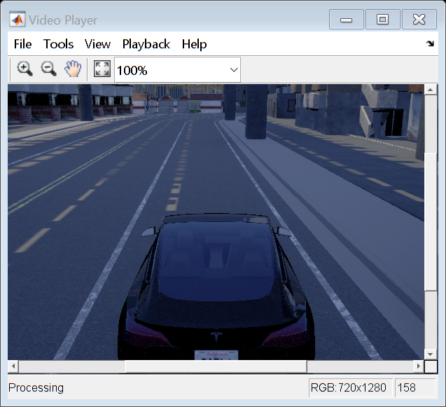

# Carla & MATLAB


## [Generate MD from MLX](https://www.mathworks.com/matlabcentral/fileexchange/73993-livescript2markdown-matlab-s-live-scripts-to-markdown)

* **Step 1:** Save live script as LaTeX


* **Step 2:** `mdfile = latex2markdown(filename,options)`

## Image folder

```matlab:Code
imgs = dir("_out\*.png")
```

|Fields|name|folder|date|bytes|isdir|datenum|
|:--:|:--:|:--:|:--:|:--:|:--:|:--:|
|1|'00001229.png'|'C:\\Users\\ydebray\...|'20-févr.-2021 12:48...|1575535|0|7.3821e+05|
|2|'00001230.png'|'C:\\Users\\ydebray\...|'20-févr.-2021 12:48...|1575036|0|7.3821e+05|
|3|'00001231.png'|'C:\\Users\\ydebray\...|'20-févr.-2021 12:48...|1574704|0|7.3821e+05|
|4|'00001232.png'|'C:\\Users\\ydebray\...|'20-févr.-2021 12:48...|1574134|0|7.3821e+05|
|5|'00001233.png'|'C:\\Users\\ydebray\...|'20-févr.-2021 12:48...|1573079|0|7.3821e+05|
|6|'00001234.png'|'C:\\Users\\ydebray\...|'20-févr.-2021 12:48...|1571314|0|7.3821e+05|
|7|'00001235.png'|'C:\\Users\\ydebray\...|'20-févr.-2021 12:48...|1574142|0|7.3821e+05|
|8|'00001236.png'|'C:\\Users\\ydebray\...|'20-févr.-2021 12:48...|1575037|0|7.3821e+05|
|9|'00001239.png'|'C:\\Users\\ydebray\...|'20-févr.-2021 12:48...|1574708|0|7.3821e+05|
|10|'00001240.png'|'C:\\Users\\ydebray\...|'20-févr.-2021 12:48...|1574127|0|7.3821e+05|


```matlab:Code
imgFolder = "_out";
imds = imageDatastore(imgFolder);

videoPlayer = vision.VideoPlayer;

reset(imds);
reset(videoPlayer)

while hasdata( imds )   
   I = read( imds );
   step(videoPlayer,I);
end
```





```matlab:Code
% Show recorded images 
i = 48;
img = imread(string(imds.Files(i)));
imshow(img)
```


## Pre-trained vehicle detector

```matlab:Code
i = 48;
detector = vehicleDetectorACF('front-rear-view');
img = imread(string(imds.Files(i)));
[bboxes,scores] = detect(detector,img);
if ~isempty( bboxes )
    img = insertObjectAnnotation(img,'rectangle',bboxes,scores);
end
imshow(img)
```


